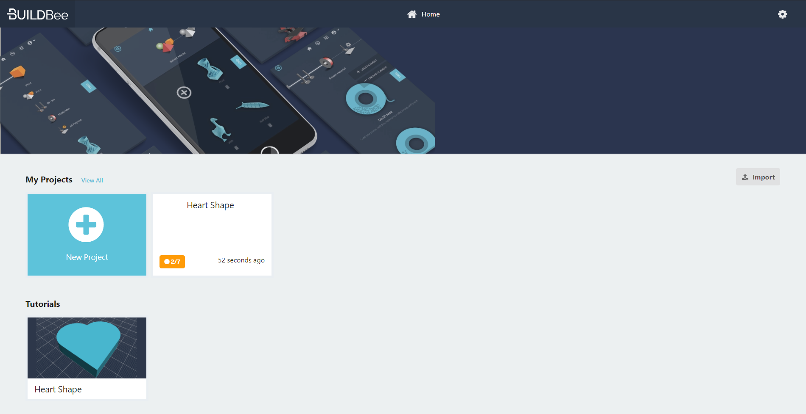
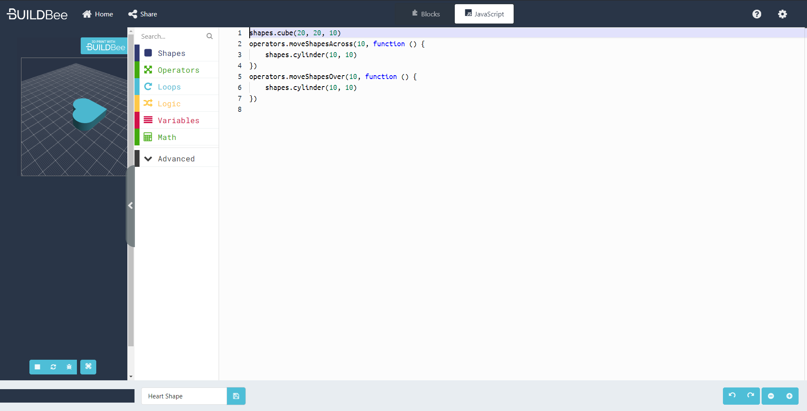

# BuildBee MakeCode Editor - 3D printing with block coding
Try it live: https://makecode.buildbee.com

The team at BuildBee is using Microsoft MakeCode to let you create physical things with block coding and javascript.  Based on an OpenJSCad libraries, the designer allows you to define parts and send them to your 3D printer with Buildbee. 

Project status: It works great so... Pretty close ¯\\\_(ツ)\_/¯ ?!?





# About BuildBee 
BuildBee is 3D printing software that makes managing the workflow of 3D printing much simpler.  The BuildBee Desktop app (Mac/Win) connects to most 3D printers and guides you step by step through the printing process, offering taylored presets for different kinds of prints. Currently used widely across the Australian school system, it is used to manage queuing, groups and printing permissions for schools and universities. 

For more information, check out 
https://buildbee.com/

# About PXTs

This repo contains an editor built with [Microsoft MakeCode (PXT)](https://github.com/Microsoft/pxt). The editor is hosted on the GitHub pages at [http://microsoft.github.io/pxt-sample/](http://microsoft.github.io/pxt-sample/)

[](https://travis-ci.org/Microsoft/pxt-sample)
[](https://aka.ms/makecodecommunity)


## Running locally

These instructions allow to run locally to modify the sample.

### Setup

The following commands are a 1-time setup after synching the repo on your machine.

* install [node.js](https://nodejs.org/en/)

* install the PXT command line
```
npm install -g pxt
```
* install the dependencies
```
npm install
```

### Running the local server

After you're done, simple run this command to open a local web server:
```
yarn start
```

After making a change in the source, refresh the page in the browser.


# Adding new examples

Housekeeping: Please use lowercase for all filenames and dashes for all filenames.


* Design your project and then flip over to the javascript mode
* Take a screenshot and save as project-image.png
* Copy and paste into a markdown file
* For step-by-step tutorials, follow the formatting in heart-shape.md
* List your project by adding a codecard to tutorials.md or examples.md
* To test your new example 
```yarn checkdocs && yarn start```


## Example code location
Add your code to the following location
```docs/examples/example-name.md```

Follow this guide to work out the format
https://makecode.com/writing-docs/tutorials

Or look at heart-shape.md

## Example image locations
Add your project images to the following location
```static/examples/example-name/project-image.png```

## List your project
List your step-by-step tutorials to the list using codecards

```docs/tutorials.md```

List your finished examples to the list using codecards
 
```docs/examples.md```

